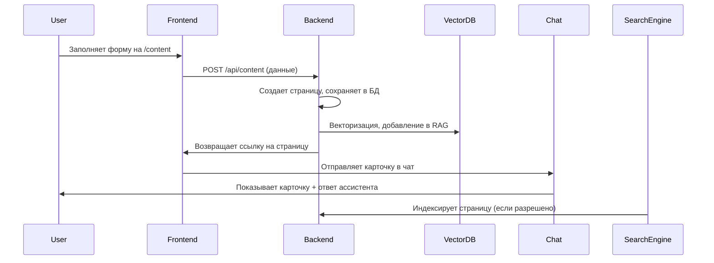
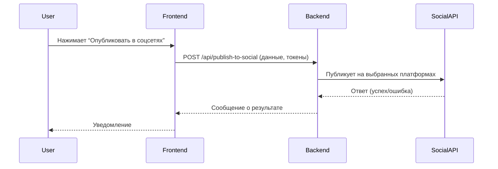

# Интерактивный обмен веб-страницами с ИИ-ассистентом в корпоративном чате

## Описание задачи

Реализовать функционал, позволяющий пользователям создавать веб-страницы с данными о компании, продуктах или статьями (блог), делиться ими в корпоративном чате в виде интерактивных сообщений с кнопками, а также обеспечивать автоматическое добавление этих страниц в базу знаний (RAG) для поиска и генерации ответов ИИ-ассистентом. Страницы должны быть доступны для поиска в интернете по ключевым словам.

---

## Основные требования

1. **Создание веб-страниц**
    - Форма на странице `/content` для ввода информации (название, описание, текст, теги, изображения и т.д.).
    - Возможность предпросмотра и редактирования страницы до публикации.
    - Кнопка "Поделиться", после нажатия которой страница сохраняется и становится доступной для дальнейших действий.

2. **Публикация и доступность**
    - После публикации страница доступна по уникальному URL (например, `/content/page/123` или `/content/page/название`).
    - Страница оптимизирована для SEO (мета-теги, ЧПУ-адреса, sitemap.xml).
    - При необходимости — настройка индексации для поисковых систем (robots.txt).
    - **Оптимизация для ИИ-поиска**: страницы должны быть структурированы и открыты для индексации поисковыми ИИ (Perplexity, GPT, Gemini и др.). Рекомендуется:
        - Использовать семантическую разметку (schema.org, JSON-LD)
        - Добавлять структурированные данные (FAQ, Article, Product)
        - Открывать страницы для crawler-ботов ИИ (не блокировать их в robots.txt)
        - Обеспечивать чистый, легко читаемый HTML-код
        - Добавлять релевантные ключевые слова и теги

3. **Интеграция с корпоративным чатом**
    - После публикации пользователь может отправить страницу в чат с помощью кнопки "Поделиться в чат".
    - В чате появляется интерактивное сообщение (карточка) с краткой информацией о странице и кнопкой (например, "Показать содержимое").
    - При нажатии на кнопку ассистент отправляет содержимое страницы (или его резюме) в чат.
    - Возможность задать вопрос по содержимому страницы через чат (ассистент ищет ответ только в этой странице).
    - При публикации страницы в чатах пользователей (веб, Telegram, email) вместе с ответами на сообщения должно автоматически добавляться интерактивное сообщение с заголовком страницы и кнопкой "Подробнее". При нажатии на кнопку ИИ-ассистент отправляет содержимое веб-страницы в чат.

4. **Интеграция с RAG (Retrieval-Augmented Generation)**
    - После публикации страница автоматически разбивается на смысловые блоки (например, по абзацам).
    - Каждый блок векторизуется (создается embedding) и сохраняется в векторное хранилище (Qdrant, Pinecone и т.д.) с метаданными (id страницы, теги, автор, дата).
    - Ассистент использует эти данные для поиска и генерации ответов на вопросы пользователей.
    - В форме создания страницы добавить выпадающий список "Интегрировать с RAG" (Да/Нет). При выборе "Да" ИИ-ассистент анализирует содержимое страницы, автоматически предлагает список возможных вопросов и ответов (Q&A) по теме страницы. Пользователь может отредактировать эти вопросы и ответы, отметить чекбоксами нужные и нажать "Добавить" — выбранные Q&A будут сохранены в базу знаний для последующего поиска и генерации ответов.

5. **Поиск в интернете**
    - Страницы доступны для индексации поисковыми системами.
    - Поиск по ключевым словам приводит к отображению соответствующих страниц.

---

## Пользовательские сценарии

1. **Создание и публикация страницы**
    - Пользователь заполняет форму на `/content`, нажимает "Поделиться".
    - Страница сохраняется, появляется уникальный URL.

2. **Обмен в чате**
    - Пользователь нажимает "Поделиться в чат".
    - В чате появляется карточка с кнопкой "Показать содержимое".
    - Другой пользователь нажимает кнопку — ассистент отправляет содержимое страницы в чат.

3. **Поиск и ответы ассистента**
    - Пользователь задаёт вопрос по теме страницы.
    - Ассистент ищет ответ в RAG по содержимому страницы и формирует релевантный ответ.

4. **Поиск через интернет**
    - Внешний пользователь находит страницу через поисковик по ключевым словам.

---

## Техническая реализация

### Frontend
- Vue.js, локальные scoped-стили
- Форма создания/редактирования страницы
- Компонент карточки для чата с интерактивной кнопкой

### Backend
- Node.js/NestJS/Fastify/Express
- REST API для создания, публикации, получения страниц
- Векторизация и интеграция с векторным хранилищем (Qdrant, Pinecone)
- Генерация и отправка сообщений в чат

### Векторное хранилище (RAG)
- Сохранение embedding-блоков с метаданными
- Поиск по embedding для генерации ответов ассистентом

### SEO и индексация
- Генерация мета-тегов, sitemap.xml
- ЧПУ-адреса страниц
- Настройка robots.txt

---

## Диаграмма взаимодействия

---

## Примечания
- Все компоненты должны быть реализованы с учетом безопасности и приватности данных.
- Необходимо предусмотреть возможность удаления и редактирования страниц.
- Для интеграции с ИИ-ассистентом использовать современные RAG-фреймворки (LlamaIndex, LangChain и т.д.).
- Для векторизации использовать актуальные модели (OpenAI, Sentence Transformers и др.). 

---

## Автоматический выбор и добавление интерактивных сообщений ИИ-ассистентом

ИИ-ассистент может самостоятельно анализировать контекст диалога и принимать решение о добавлении интерактивных сообщений (карточек) в чат, чтобы повысить релевантность и удобство взаимодействия.

### Принцип работы

1. **Анализ контекста диалога**
    - Ассистент анализирует сообщения пользователя, определяет тему, намерение и ключевые слова.
    - Выполняет поиск по базе знаний (RAG) для нахождения релевантных страниц или блоков.

2. **Принятие решения о вставке интерактивного сообщения**
    - Если найден релевантный контент, ассистент решает, нужно ли добавить карточку с кнопкой (например, "Подробнее").
    - Решение зависит от:
        - Тематики и повторяемости вопросов
        - Новизны или важности контента
        - Явных триггеров в сообщениях пользователя (например, "покажи инструкцию", "расскажи подробнее" и т.д.)

3. **Формирование интерактивного сообщения**
    - Ассистент формирует карточку с заголовком, кратким описанием и кнопкой (например, "Подробнее").
    - При нажатии на кнопку пользователем ассистент отправляет содержимое страницы или выбранного блока в чат.

### Пример сценария

- Пользователь: "Как подключить наш продукт X?"
- Ассистент:
    1. Находит в RAG инструкцию по подключению продукта X.
    2. Отвечает кратко и автоматически добавляет интерактивную карточку с кнопкой "Показать инструкцию".
    3. При нажатии на кнопку отправляет подробную инструкцию в чат.

### Преимущества
- Пользователь получает релевантную информацию в нужный момент, не перегружая чат лишними карточками.
- Ассистент становится более "умным" и проактивным.
- Повышается вовлечённость и удовлетворённость пользователей. 

---

## Публикация страниц в социальных сетях и блогах через API

Система может поддерживать публикацию созданных страниц на страницах компании в социальных сетях и блогах (Medium, LinkedIn, Instagram, Paragraph, Telegraph, Telegram и др.) с помощью соответствующих API.

### Возможности
- Публикация статей и постов на платформах: Medium, LinkedIn (страницы компаний), Instagram (бизнес-аккаунты), Paragraph, Telegraph, Telegram (боты/каналы) и др.
- Выбор платформ для публикации пользователем (чекбоксы или список).
- Формирование контента с учётом особенностей каждой платформы (текст, изображения, разметка).

### Принцип работы
1. Пользователь выбирает опцию "Опубликовать в соцсетях" после создания страницы.
2. Открывается окно выбора платформ и авторизации (OAuth2, если требуется).
3. Для каждой платформы формируется подходящий формат контента.
4. Система отправляет запросы к API выбранных платформ для публикации.
5. Пользователь получает уведомление об успешной публикации или ошибке.

### Ограничения и нюансы
- Для некоторых платформ требуется бизнес-аккаунт и прохождение модерации приложения (LinkedIn, Instagram).
- Формат и объём контента может отличаться (например, Instagram — только изображение+текст).
- Возможны лимиты на частоту публикаций и размер постов.
- Некоторые платформы могут задерживать публикацию для модерации.

### Пример архитектуры

### Рекомендации
- Для каждой платформы реализовать отдельный модуль интеграции или использовать сторонние сервисы (Zapier, Make).
- Предусмотреть очередь публикаций и логи для отслеживания статуса.
- Обеспечить безопасное хранение и обновление токенов авторизации. 